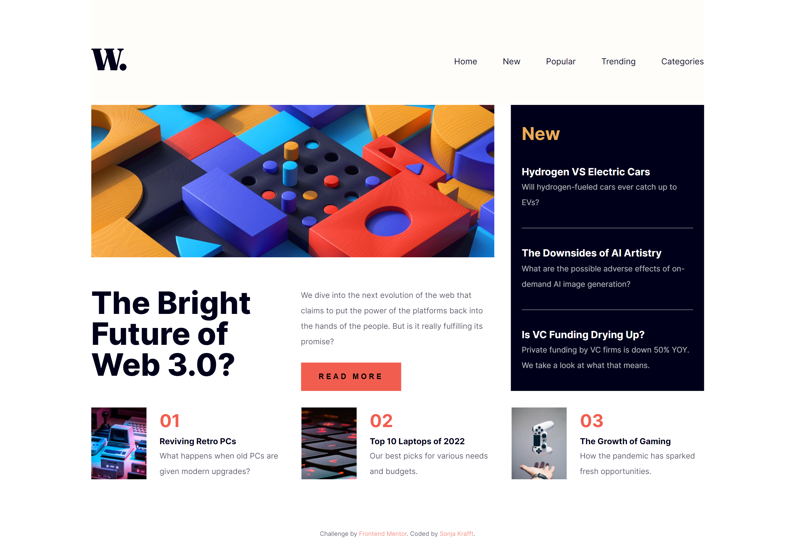
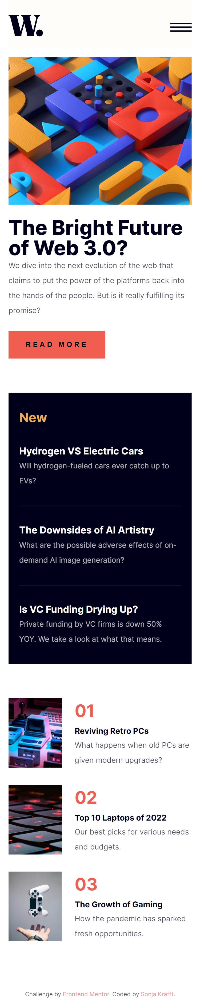

# Frontend Mentor - News homepage solution

This is a solution to the [News homepage challenge on Frontend Mentor](https://www.frontendmentor.io/challenges/news-homepage-H6SWTa1MFl). Frontend Mentor challenges help you improve your coding skills by building realistic projects. 

## Table of contents

- [Overview](#overview)
  - [The challenge](#the-challenge)
  - [Screenshot](#screenshot)
  - [Links](#links)
- [My process](#my-process)
  - [Built with](#built-with)
  - [What I learned](#what-i-learned)
- [Author](#author)

## Overview

### The challenge

Users should be able to:

- View the optimal layout for the interface depending on their device's screen size
- See hover and focus states for all interactive elements on the page

### Screenshot




### Links

- Live Site URL: [Add live site URL here](https://your-live-site-url.com)

## My process

### Built with

- HTML, SCSS, JS
- Mobile-first workflow
- Webstorm with Simple Hot Reload Server (install: `npm install -g simple-hot-reload-server`, start: `hrs`) and File Watcher with SCSS for building CSS

### What I learned

Use this section to recap over some of your major learnings while working through this project. Writing these out and providing code samples of areas you want to highlight is a great way to reinforce your own knowledge.

To see how you can add code snippets, see below:

- Hamburger Menu
```html
<a id="btnHamburger" href="#" class="header__toggle open hide-for-desktop">
  <span></span>
  <span></span>
  <span></span>
</a>
```
```css
.header .open {
  .header__toggle {
    > span:first-child {
      transform: rotate(45deg);
    }

    > span:nth-child(2) {
      opacity: 0;
    }

    > span:last-child {
      transform: rotate(-45deg);
    }
  }
}

.header__toggle { // Animated Button
z-index: 2;

  > span {
    display: block;
    width: 2.5rem;
    height: 0.1875rem;
    background-color: $very-dark-blue;
    transition: all 300ms ease-in-out;
    transform-origin: 0.625rem 0.0625rem;

    &:not(:last-child){
      margin-bottom: 0.25rem;
    }
  }
}
```
```js
btnHamburger.addEventListener("click", function () {
  if (header.classList.contains("open")) {
    header.classList.remove("open");
    fadeElems.forEach(function (elem) {
      elem.classList.add("fade-out");
      elem.classList.remove("fade-in");
    });
  } else {
    header.classList.add("open");
    fadeElems.forEach(function (elem) {
      elem.classList.add("fade-in");
      elem.classList.remove("fade-out");
    });
  }
});
```
- Animation
```css
.has-fade {
  visibility: hidden;
}

@keyframes fade-in {
  from {
    visibility: hidden;
    opacity: 0;
  }

  to {
    visibility: visible;
    opacity: 1;
  }
}
.fade-in {
  animation: fade-in 300ms ease-in-out forwards;
}

@keyframes fade-out {
  from {
    visibility: visible;
    opacity: 1;
  }

  to {
    visibility: hidden;
    opacity: 0;
  }
}
.fade-out {
  animation: fade-out 300ms ease-in-out forwards;
}
```
- Overlay over whole screen
```css
  .overlay {
  position: fixed;
  top: 0;
  right: 0;
  bottom: 0;
  left: 0;
  background: rgba($very-dark-blue, 0.5);
}
```
- Visibility
```css
.hide-for-mobile {
  @include breakpoint-down(medium){
    display:none;
  }
}

.hide-for-desktop {
  @include breakpoint-up(large){
    display:none;
  }
}
```

## Author

- Github - [Sonja Krafft](https://www.github.com/sonmikrafft)
- Frontend Mentor - [@sonmikrafft](https://www.frontendmentor.io/profile/sonmikrafft)